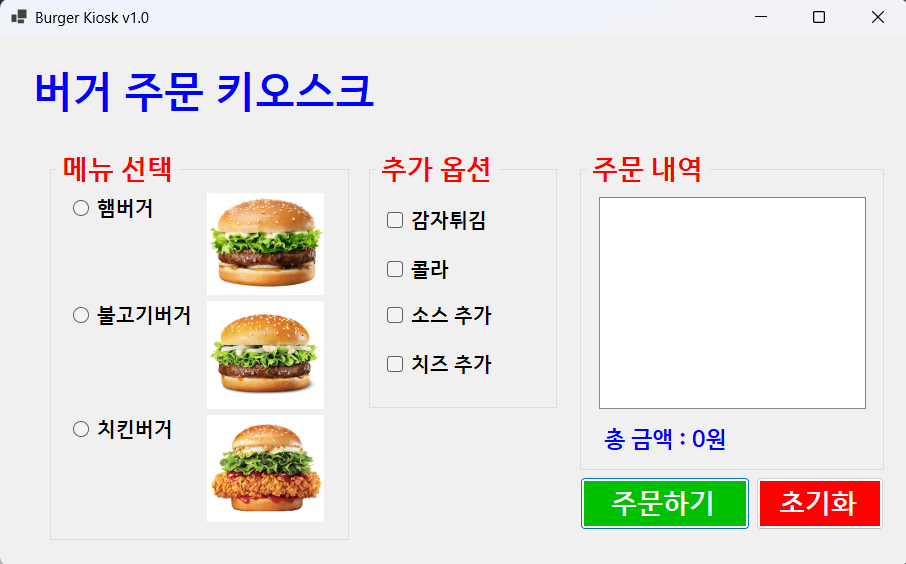
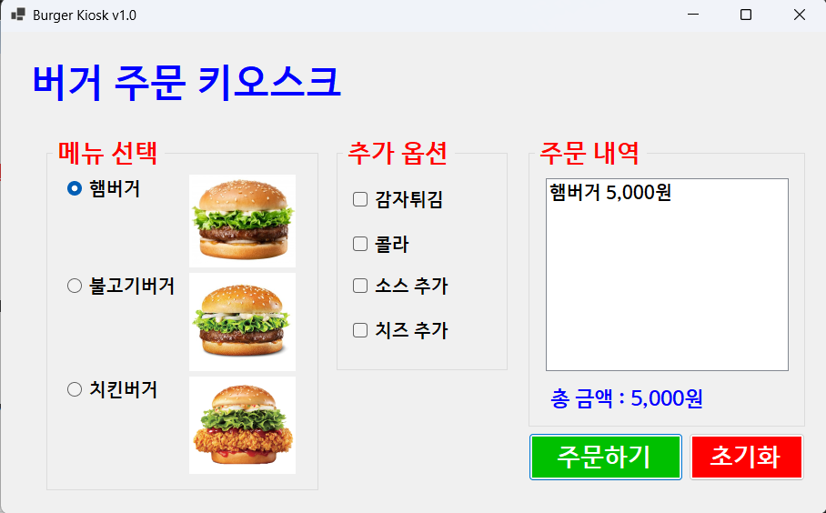
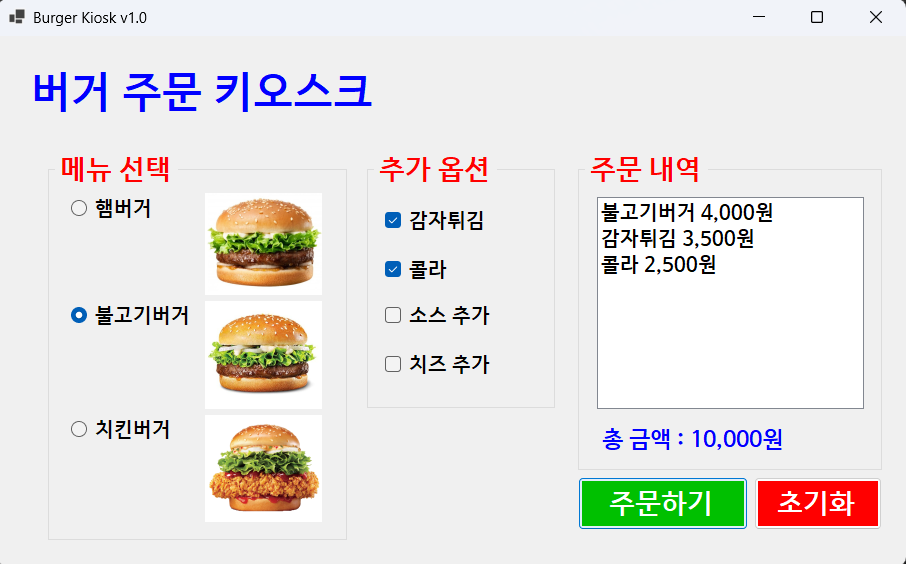
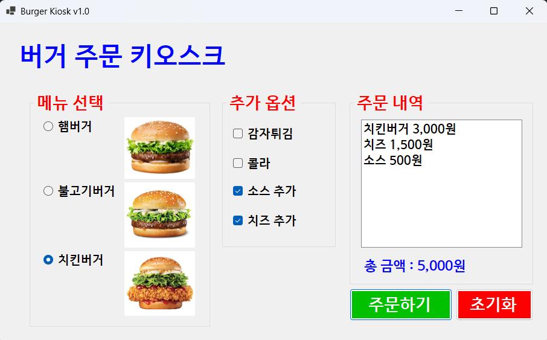

# (C# 코딩) 버거 키오스크

## 개요
- C# 프로그래밍 학습
- 1줄 소개: 메뉴와 추가옵션을 선택하는 키오스크 주문 화면 제작
- 사용한 플랫폼:
	- .NET Windows Forms, Visual Studio, GitHub
- 사용한 컨트롤:
	- Label, RadioButton, CheckBox, Button, ListBox, GroupBox
- 사용한 기술과 구현 기능:
	- 이벤트 핸들링: 버튼 클릭 시 주문 처리
	- 데이터 바인딩: 메뉴와 옵션을 ListBox에 표시
	- 조건문: 선택된 메뉴와 옵션에 따라 가격 계산
	- UI 디자인: 사용자 친화적인 인터페이스 구성

## 실행화면
- 코드 실행 스크린샷과 구현 내용 설명

- 구현한 내용 (위 그림 참조)
	- UI 구성: Label(앱 이름 표시), GroupBox(메뉴 선택), RadioButton(햄버거, 불고기버거, 치킨버거), CheckBox(추가 옵션), Button(주문하기, 초기화), ListBox(주문 내역)
	- 메뉴 선택: RadioButton을 사용하여 햄버거, 불고기버거, 치킨버거 중 하나를 선택
	- 추가 옵션: CheckBox를 사용하여 치즈, 베이컨, 양상추 추가 선택
	- 주문 처리: Button 클릭 시 선택된 메뉴와 옵션을 기반으로 주문 내역을 ListBox에 추가
	- 초기화 기능: 초기화 버튼 클릭 시 모든 선택을 초기화하고 주문 내역을 지움